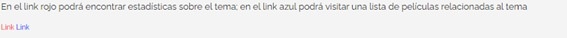
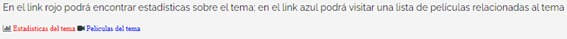
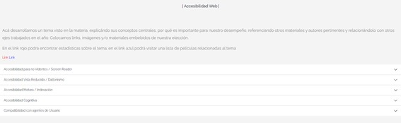
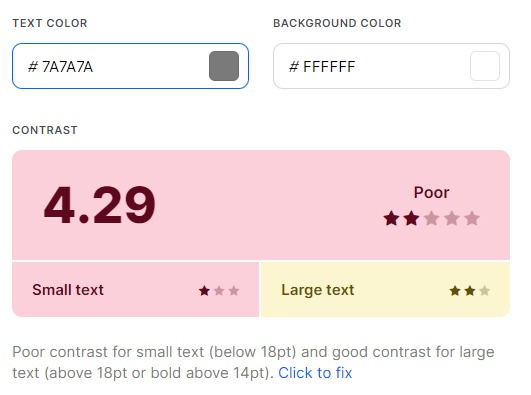
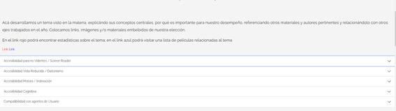
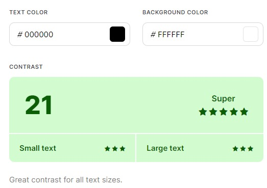
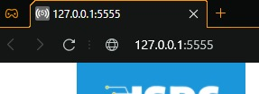
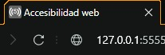

# 1.4.1 – Empleo del color

### En la página se presenta que en un *link rojo* encontrará información estadística mientras que en un **link azul** encontrará una lista de películas relacionadas con el tema. Esto hace que personas con deficiencias visuales no puedan distinguir entre un link u otro.
 

##### Captura del problema.
<!--Imagen por local-->

### **Corrección**: El título del enlace debe ser descriptivo y fácilmente identificable, además se podría acompañar a los enlaces con un icono que indique si es un enlace a estadísticas o una película del tema, facilitando su identificación.
 

##### Captura de la corrección.
<!--Imagen por local-->

 

<!-- Titulo -->
# 1.4.3 – Contraste (mínimo) 

### La página presenta un contraste deficiente en su contenido debido a que su color (#7a7a7a) que da un contraste con el fondo de 4.29, lo que lo hace difícil de leer y casi imposible en presencia de ciertas discapacidades visuales.
 

##### Captura de problema de accesibilidad.
<!--Imagen por local-->

##### Captura de problema de contraste.
<!--Imagen por local-->

### **Corrección**: cambiar el color de fuente para que tenga mayor contraste con el fondo, en nuestro caso cambiaremos el color a **negro (#000000)** aumentando así el contraste con el fondo a **21** facilitando su lectura para todos los tamaños.
 

##### Captura de solucion de accesibilidad.
<!--Imagen por local-->

##### Captura de solucion al problema de contraste.
<!--Imagen por local-->

 

<!-- Titulo -->
# 2.4.2 - Página no titulada

### La página no presenta un título, lo que hace más difícil reconocerla y a su contenido.
 

##### Captura tomada desde el servidor local presentando el problema.
<!--Imagen por local-->

### **Corrección**: Agregar el tag *“title”* en el head del documento HTML. Al hacer esto es más fácil reconocer al sitio web y a su contenido debido a la presencia de un título descriptivo.
 

##### Captura de pagina titulada "accesibilidad web".
<!--Imagen por local-->

 