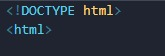

# 1.1.1 - Contenido no textual

### La imagen que hace de logo en la página no presenta un texto alternativo que las tecnologías de asistencia puedan reconocer

### **Correccion:** Agregarle un texto que describa de que se trata o cual es la función que cumple dicha imagen, en este caso “Logo ISPC”

# 1.4.1 – Empleo del color

### En la página se presenta que en un *link rojo* encontrará información estadística mientras que en un **link azul** encontrará una lista de películas relacionadas con el tema. Esto hace que personas con deficiencias visuales no puedan distinguir entre un link u otro.
 

##### Captura del problema.
<!--Imagen por local-->

### **Corrección**: El título del enlace debe ser descriptivo y fácilmente identificable, además se podría acompañar a los enlaces con un icono que indique si es un enlace a estadísticas o una película del tema, facilitando su identificación.
 

##### Captura de la corrección.
<!--Imagen por local-->

<!--Titulo-->
# 2.4.4 - Propósito de un vinculo (en su contexto)

### Continuando con lo detallado anteriormente en el punto 1.4.1 Empleo del color. Se visualizan los textos con el mayor sentido posible ayudando a los usuarios que desean seleccionar los enlaces a partir de su titulo y no tanto a partir de su contexto, permitiendoles navegar tabulando a traves de los enlaces con mayor facilidad
### **Correccion**: Este punto fue solucionado junto con el punto anterior al hacer que los enlaces tengan titulos que describan el contenido al que te dirigen, disminuyendo la necesidad de conocer todo su contexto para saber su contenido.

 

<!-- Titulo -->
# 1.4.3 – Contraste (mínimo) 

### La página presenta un contraste deficiente en su contenido debido a que su color (#7a7a7a) que da un contraste con el fondo de 4.29, lo que lo hace difícil de leer y casi imposible en presencia de ciertas discapacidades visuales.
 

##### Captura de problema de accesibilidad.
<!--Imagen por local-->

##### Captura de problema de contraste.
<!--Imagen por local-->

### **Corrección**: cambiar el color de fuente para que tenga mayor contraste con el fondo, en nuestro caso cambiaremos el color a **negro (#000000)** aumentando así el contraste con el fondo a **21** facilitando su lectura para todos los tamaños.
 

##### Captura de solucion de accesibilidad.
<!--Imagen por local-->

##### Captura de solucion al problema de contraste.
<!--Imagen por local-->

 

# 1.4.4 - Cambio de tamaño de fuente

### La página presenta la posibilidad de aumentar el tañano de fuente mediante el zoom del navegador únicamente, dejando excluídos de tal funcionalidad a aquellos usuarios que utilicen entornos que no la provean (como ser Internet Explorer 6.0 o Firefox)

##### Captura de error de tamaño de texto

### **Corrección:** Se podría agregar un control que mediante un script aumente o disminuya el tamaño de fuente general de la página, dándole acceso a esta funcionalidad a todos los usuarios del sitio sin importar el entorno que usen para navegar el sitio.

##### Capturas de la solución al error de tamaño de fuente

.jpg "Captura tomada desde la web")

### Estos botones nos permiten aumentar y/o disminuir el tamaño general de la fuente de la página

# 2.1.1 - Teclado

### Cuando la página se encuentra en modo móvil (ancho de pantalla menor a 995px), la barra de navegación pasa a ser un menú desplegable y el botón para desplegarlo no es accesible vía teclado por lo que, si el menú se encuentra colapsado, las opciones del mismo no son accesibles vía teclado.

##### Capturas del error de accesibilidad de teclado
###### Menu colapsado
.jpg "Captura tomada desde la web")

###### Menu expandido (las opciones: principal, temas y sobre nosotros, son accesibles con teclado)
.jpg "Captura tomada desde la web")

### **Posible corrección:** La forma que encontramos para arreglar este problema fue modificar en parte la estructura del código de la barra de navegación (nav) permitiendo así que el botón para desplegar el menú esté dentro del tab index del teclado en el 3º lugar.

<!-- Titulo -->
# 2.4.2 - Página no titulada

### La página no presenta un título, lo que hace más difícil reconocerla y a su contenido.
 

##### Captura tomada desde el servidor local presentando el problema.
<!--Imagen por local-->

### **Corrección**: Agregar el tag *“title”* en el head del documento HTML. Al hacer esto es más fácil reconocer al sitio web y a su contenido debido a la presencia de un título descriptivo.
 

##### Captura de pagina titulada "accesibilidad web".
<!--Imagen por local-->

 

# 3.1.1 - Idioma de la página

### La apertura de la etiqueta HTML no tiene definido el atributo “Lang” el cual es el responsable de determinar el lenguaje de la página.

### **Correccion:** Declarar el atributo “Lang” con valor “es” (lang=”es”) dentro de la etiqueta de apertura HTML. De esta manera l e indicamos al navegador o tecnología de asistencia que utilice el usuario que la página está en idioma español.

 
